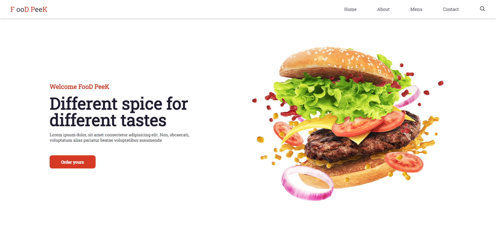

# web-site-
Criando um web site do zero
<h1 align="center"> WebSite </h1>

Projeto feito através do video do Dev Envolvente!

  <a href="#-tecnologias">Tecnologias</a>     |    
  <a href="#-projeto">Projeto</a>     |    
  <a href="#-layout">Layout</a>     |    
  <a href="#memo-licença">Licença</a>

  

 

  

  

##  🚀 Tecnologias

Esse projeto foi desenvolvido com as seguintes tecnologias:

- HTML e CSS
- JavaScript
- Git e Github

## : memo : Licença 

Esse projeto está sob a licença MIT.

---
